## Reactive plotting with Tableau

### Brief description

Tableau  is a visualization software used in businesses to create static and dynamic plots that can easily be shared within and across organizations. Founded in 2003 through a computer science project at Stanford, Tableau introduces a more “drag-and-drop” approach when it comes to data viz platform. Unlike Dash, Tableau requires paid subscription and the company has a community and foundation to support client care. Some of the big name corporations such as Coca Cola, Nokia, Forbes, ebay, Dell etc are enterprise clients of Tableau. 
It all starts with choosing the right data type to import in tableau through drop-down interface. Then once the data is imported the data can be browsed in a tabuar fashion and several variables can be set according to their properties such as numeric, categorical, string, etc. There are several side bars in Tablaeu interface, which holds different sections controlling input source (sheets), plot type, and also numbers of plots. The canvas of the dashboard can be filled with multiple plots showing multiple reactive plots. By selecting and de-selecting sheets, data sources can be controlled. Finally, the dashboard can be deployed to a webpage or can be saved stand-alone to view offline.
 

### Long description

#### Basic way of creating a reactive plot

A reactive plot is a system by which you can instantly update your data constructs and the graphs, charts, and other visual cues to tell your story in real time. A reactive plot has several steps: 

<figure align="center">
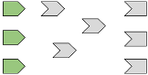
<figcaption align = "center"><b>A session begins</b></figcaption>
</figure>
 
 
 
 
<figure align="center">
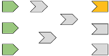
<figcaption align = "center"><b>Execution begins</b></figcaption>
</figure>
 
 
 
 
<figure align="center">
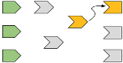
<figcaption align = "center"><b>Reading a reactive expression</b></figcaption>
</figure>
 
 
 
 
<figure align="center">
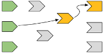
<figcaption align = "center"><b>Reading an input</b></figcaption>
</figure>
 
 
 
 
<figure align="center">
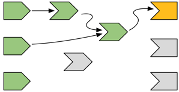
<figcaption align = "center"><b>Reactive expression completes</b></figcaption>
</figure>
 
 
 
 
<figure align="center">
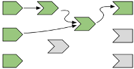
<figcaption align = "center"><b>Output completes	</b></figcaption>
</figure>
 
 
 
 
<figure align="center">
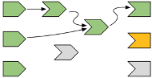
<figcaption align = "center"><b>The next output executes</b></figcaption>
</figure>
 
 
 
 
<figure align="center">
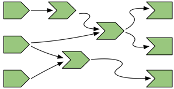
<figcaption align = "center"><b>Execution completes, outputs flushed</b></figcaption>
</figure>
 
 
 
 
<figure align="center">
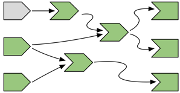
<figcaption align = "center"><b>Invalidating new and changed inputs</b></figcaption>
</figure>
 
 
 
 
<figure align="center">
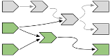
<figcaption align = "center"><b>Notifying dependencies</b></figcaption>
</figure>
 
 
 
 
<figure align="center">
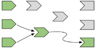
<figcaption align = "center"><b>Removing relationships</b></figcaption>
</figure>
 
 
 
 
<figure align="center">
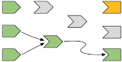
<figcaption align = "center"><b>Re-execution</b></figcaption>
</figure>
 
 

Tableau uses drop-down menus and drag-and-drop methods usually when it comes to creating a plot. First it takes in data. This can be in several format. The data can be imported through the import option from the drop-down menu. 

<figure align="center">
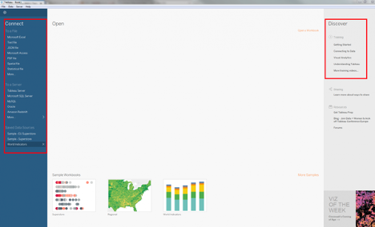
<figcaption align = "center"><b>Importing file</b></figcaption>
</figure>
 
 
After importing the data several metrics can be set from the information from the data: 

<figure align="center">
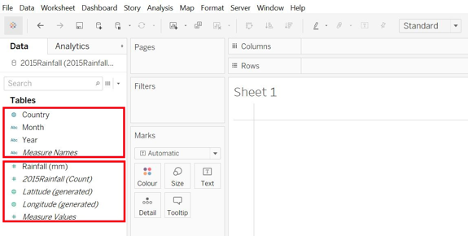
<figcaption align = "center"><b>Choosing sheets</b></figcaption>
</figure>
 
 
After figuring out what do we need to visualize we can select the appropriate method from the drop-down menu: 

<figure align="center">
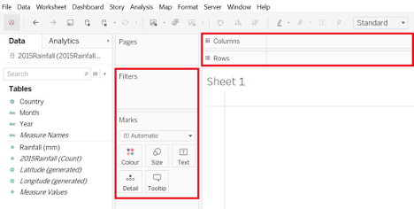
<figcaption align = "center"><b>Choosing methods</b></figcaption>
</figure>
 
 
This will create plots like the following: 

<figure align="center">
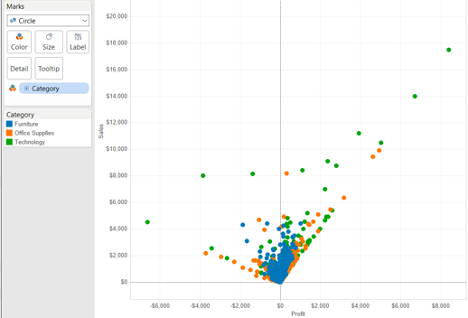
<figcaption align = "center"><b>Scatter plot</b></figcaption>
</figure>
 
 
The reactivity can be controlled through the many switches along the side-bar: 

<figure align="center">
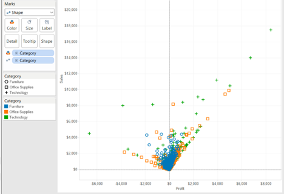
<figcaption align = "center"><b>Choosing from Side bar</b></figcaption>
</figure>
 
 

#### Reactive plot with more than one input

In the plot below we can also see that we can create a plot that react to multiple inputs by adding more filters and editing these filters. We can drag multiple data fields to the “filter” section and customize each filter after clicking on “edit filter.” Alternatively, we can also click on multiple data fields (inputs) and click on “show filter,” then the inputs will show under the “filter” section. These filters, such as sliders and check boxes, usually will show on the right-hand side of the Tableau screen. 

<figure align="center">
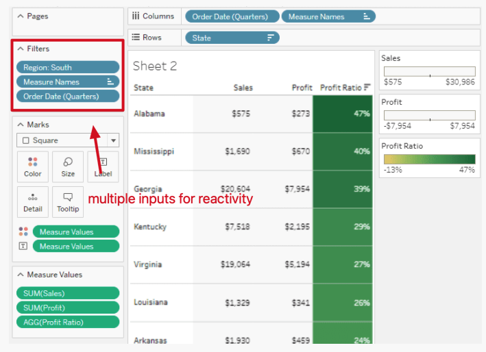
<figcaption align = "center"><b>Choosing multiple inputs</b></figcaption>
</figure>
 
 

#### Creating more than one reactive output

We can visualize multiple plots derived from multiple data source (sheets) through Tablaeu. We can compile all the plots into sheets and then compile worksheets, dashboards or stories. For each plot, we can make them reactive using above mentioned methods.  

<figure align="center">
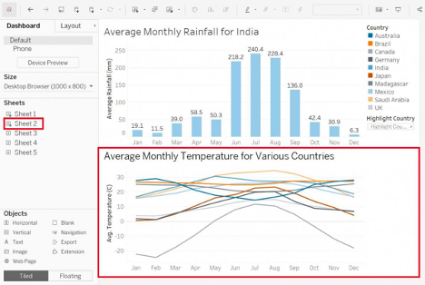
<figcaption align = "center"><b>Multiple plots</b></figcaption>
</figure>
 
 
Finally our reactive plot or dashboard can be deployed to a webpage for viewing: 

<figure align="center">
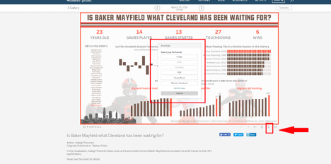
<figcaption align = "center"><b>Reactive dashboard</b></figcaption>
</figure>
 
 

### Links

* https://www.tableau.com
* https://hfboyce.github.io/tableau_course/intro.html
* https://github.com/hfboyce/mds_tableau_workshop
* https://help.tableau.com/current/guides/get-started-tutorial/en-us/get-started-tutorial-build.htm
* http://www.ttdatavis.onthinktanks.org/how-tos/how-to-create-interactive-dashboards-with-tableau-public
* https://www.tableau.com/about/blog/2012/7/filtering-parameters-18326 

